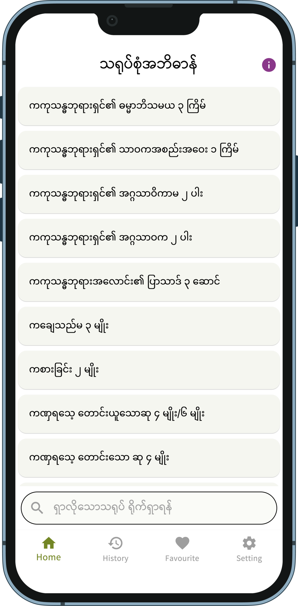

# Pitaka Sarupa

A new Flutter Project

## A quantitative dictionary of tipitaka
## ပိဋကတ်သုံးပုံ သရုပ်စုံ အဘိဓာန်

နိကာယ်ငါးရပ် ပိဋကသုံးပုံ ပါဠိတော်၊ အဋ္ဌကထာနှင့် ဋီကာကျမ်းတွေ၌ လာရှိသော သရုပ် (အရေအတွက်ပြတရားတော်) များကို ရှာဖွေစုဆောင်း တင်ပြထားသော ကျမ်းစာဖြစ်ပါသည်။

 
IOS application ကို App Store တွင် ရယူနိုင်ပါသည်။

